# 25D Mining Ball Precise Flow And Audit Guide

This document is a code-truth view of the current 2.5D mining-ball path implemented in:

- `vision_3d_acquisition/vision_core/pipelines/stages_25d.py`
- `vision_3d_acquisition/apps/ball_inspection_25d/pipeline.py`
- `frontend/src/components/stageSemantics.ts`
- `frontend/src/components/stage_view_renderers/index.tsx`

It is intentionally narrower than the broader pipeline spec. The goal here is:

- one precise Mermaid diagram for the current execution path
- one practical guide for auditing the outputs of any block for one concrete take

## Precise Flow Diagram

The diagram below reflects the current `DetectBeltPlaneStage` rich path and its downstream consumers.

```mermaid
flowchart TD
  A["LoadHeightmapCaptureStage<br/>HeightmapFrame(z_mm, valid_mask)"] --> B["DetectBeltPlaneStage"]

  B --> B1["Build fit ROI<br/>plane_fit_roi_mask"]
  B1 --> B2["valid_for_fit = valid_mask ∩ roi_mask"]
  B2 --> B3["Compute percentile stats<br/>near_q / far_q"]
  B3 --> B4["Compute reference height gate<br/>height_gate_mask"]

  B4 --> C{"background_detection_strategy"}

  C -- "nearest/farthest/automatic percentile" --> C1["Legacy percentile candidate<br/>low_mask / high_mask"]
  C1 --> C2["candidate_mask"]

  C -- "low_gradient_surface" --> D1["Compute depth gradient"]
  D1 --> D2["Threshold low-gradient pixels"]
  D2 --> D3["Optional low-gradient open/close"]
  D3 --> D4["Connected-component scoring<br/>area + constancy + gradient + border + depth pref"]
  D4 --> D5["Select low-gradient component"]
  D5 --> D6["Apply height_gate_mask"]
  D6 --> D7["Reject raised/ridge support<br/>z window + ridge percentile"]
  D7 --> C2

  C -- "low_gradient_depth_plateaus" --> E1["Compute depth gradient"]
  E1 --> E2["Threshold low-gradient pixels"]
  E2 --> E3["Optional low-gradient open/close"]
  E3 --> E4["flat_candidates_pre_hessian = low_grad_mask ∩ height_gate_mask"]
  E4 --> E5{"Hessian filter enabled?"}
  E5 -- "yes" --> E6["Keep low-Hessian flat candidates"]
  E5 -- "no" --> E7["Use flat_candidates_pre_hessian"]
  E6 --> E8["Histogram flat-candidate Z"]
  E7 --> E8
  E8 --> E9["Detect depth plateaus"]
  E9 --> E10["Select background plateau<br/>lowest_dominant / largest / lowest"]
  E10 --> E11{"Plateau selected?"}
  E11 -- "yes" --> E12["candidate_mask = flat_candidates ∩ z_band(selected plateau)"]
  E11 -- "no" --> E13["Fallback: candidate_mask = flat_candidates"]
  E12 --> E14["raised_candidate_rejected_mask = flat_candidates above plateau"]
  E13 --> E14

  E14 --> F{"belt_stripe_filter_enabled<br/>and candidate_mask non-empty?"}
  F -- "no" --> C2
  F -- "yes" --> F1["Choose stripe filter domain<br/>global: valid_for_fit<br/>bg_plateau: candidate_mask"]
  F1 --> F2["Top-hat/bottom-hat stripe pass on raw z_mm<br/>baseline_map + altitude_map"]
  F2 --> F3["Threshold altitude<br/>fixed / k-MAD / Otsu"]
  F3 --> F4["tophat_stripes_mask"]
  F1 --> G1{"z-floor shape pass enabled?"}
  G1 -- "yes" --> G2["Estimate belt_z from BG plateau<br/>median + upper percentile"]
  G2 --> G3["above_belt_mask<br/>z > reference_z + margin<br/>and optional upper cap"]
  G3 --> G4["Morphological close"]
  G4 --> G5["Object-sized opening"]
  G5 --> G6["wide_object_mask"]
  G6 --> G7["shape_stripes_mask = above_belt_mask - wide_object_mask"]
  G1 -- "no" --> G8["empty shape_stripes_mask"]
  G7 --> H1["candidate_stripes = tophat_stripes_mask ∪ shape_stripes_mask"]
  G8 --> H1
  F4 --> H1
  H1 --> H2{"stripes_fraction >= min_stripe_fraction?"}
  H2 -- "yes" --> H3["stripes_mask = candidate_stripes"]
  H3 --> H4["belt_base_mask = original BG plateau ∩ ~stripes_mask"]
  H4 --> H5["candidate_mask = belt_base_mask"]
  H5 --> H6["raised_candidate_rejected_mask |= stripes_mask"]
  H2 -- "no" --> C2
  H6 --> C2

  C2 --> I["Optional candidate morphology open"]
  I --> J["Connected-component / border filtering"]
  J --> K{"Enough candidate support?"}
  K -- "no" --> L["Plane-fit failure state"]
  K -- "yes" --> M["Downsample candidate points"]
  M --> N["Estimate adaptive RANSAC threshold from candidate z-MAD"]
  N --> O["Fit plane with RANSAC"]
  O --> P{"Inlier ratio passes threshold?"}
  P -- "no" --> L
  P -- "yes" --> Q["Residual expansion over valid_for_fit<br/>abs(residual) <= tolerance"]
  Q --> R["Optional close + flood-fill"]
  R --> S["Subtract stripes from expanded_plane_mask"]
  S --> T{"plane_refit_after_expansion?"}
  T -- "yes" --> U["Least-squares refit on expanded support"]
  U --> V["final_plane_inlier_mask<br/>residual gate re-applied"]
  T -- "no" --> V
  V --> W["Subtract stripes again from final_plane_inlier_mask"]

  L --> X["Create deterministic horizontal plane<br/>z = median(valid_for_fit)"]
  W --> Y["Evaluate plane quality / residual stats"]
  X --> Y
  Y --> Z{"reference_surface_model"}
  Z -- "plane" --> ZA["Use plane coeffs"]
  Z -- "constant_z" --> ZB["Use constant_z reference"]
  Z -- "auto and plane good" --> ZA
  Z -- "auto and plane poor" --> ZB

  ZA --> ZC["Export reference_surface_selected_mask<br/>expanded_plane_mask<br/>final_plane_inlier_mask / plane_inlier_mask<br/>belt_stripes_mask_array<br/>belt_base_mask_array"]
  ZB --> ZC

  ZC --> N1["NormalizeHeightsToPlaneStage"]
  N1 --> N2["normalized_heightmap_mm<br/>authoritative height_above_belt"]

  N2 --> S1["RemoveBeltAndSegmentObjectsStage"]
  S1 --> S2["foreground = normalized > min_height_mm"]
  S2 --> S3["optional foreground &= normalized <= max_height_mm"]
  S3 --> S4["foreground &= valid_mask"]
  S4 --> S5["Load suppression mask in this order:<br/>reference_surface_selected_mask<br/>else expanded_plane_mask<br/>else plane_inlier_mask"]
  S5 --> S6{"suppress_plane_mask_in_segmentation?"}
  S6 -- "yes" --> S7["foreground &= ~plane_mask"]
  S6 -- "no" --> S8["keep foreground"]
  S7 --> S9["Subtract belt_stripes_mask_array"]
  S8 --> S9
  S9 --> S10["Persist rejected_background_residuals<br/>and rejected_belt_stripes"]
  S10 --> S11["Open -> close -> optional hole fill -> optional smoothing"]
  S11 --> S12["Connected components"]
  S12 --> S13["Min-area filter"]
  S13 --> S14["FitObjectGeometryStage -> ComputeHeightMetricsStage -> ClassifyMiningBall25DStage"]
```



## What Each Major Block Actually Emits

For the current 25D path, the most audit-relevant outputs are:

- `DetectBeltPlaneStage`
  - `reference_surface_selected_mask`
  - `expanded_plane_mask`
  - `final_plane_inlier_mask`
  - `plane_inlier_mask`
  - `belt_stripes_mask`
  - `belt_base_mask`
  - `belt_stripes_tophat_mask`
  - `belt_stripes_shape_mask`
  - `belt_above_belt_mask`
  - `belt_wide_object_mask`
  - `belt_plane.json`
  - `plane_fit_debug.json`
  - `gradient_debug.json`
  - `reference_surface_candidates.json`
  - `reference_surface_plateaus.json`
  - `flat_candidate_histogram.json`
  - `belt_stripe_filter_debug.json`

- `NormalizeHeightsToPlaneStage`
  - `normalized_heightmap`
  - `below_reference_mask`
  - `above_threshold_mask`
  - normalization diagnostics and reference model metadata

- `RemoveBeltAndSegmentObjectsStage`
  - `foreground_before_plane_suppression`
  - `plane_suppressed_mask`
  - `rejected_background_residuals`
  - `rejected_belt_stripes`
  - `normalized_height_threshold_mask`
  - `cleaned_object_mask`
  - `final_object_mask`
  - `connected_components_overlay`
  - `segmentation_debug.json`

## How To Audit One Determined Execution

There are three good audit paths, and they answer slightly different questions.

### 1. In Studio UX

Best when you want to answer:

- what did this block output visually?
- what was selected vs rejected?
- what stage actually ran?

Recommended workflow for one take:

1. Open the take in Studio.
2. Select the stage you care about.
3. Use the stage-specific views first.
4. Then use the stage `JSON` view for exact metadata and debug payloads.
5. If needed, open the Artifact Explorer for lineage and raw artifact selection.

Current stage/view mapping is defined in:

- [stageSemantics.ts](/Users/pablo/codigo/sensor_studio/frontend/src/components/stageSemantics.ts:84)
- [stage_view_renderers/index.tsx](/Users/pablo/codigo/sensor_studio/frontend/src/components/stage_view_renderers/index.tsx:117)

Most useful Studio views for this audit:

- `detect_belt_plane`
  - `Selected surface`
  - `Plane inliers`
  - `Depth gradient`
  - `Low-gradient mask`
  - `Plateau plot`
  - `Filtered depth plot`
  - `Belt base`
  - `Belt stripes`
  - `Stripes — top-hat`
  - `Stripes — shape pass`
  - `Above belt mask`
  - `Wide-object mask`
  - `Stripe altitude`
  - `Diagnostics`
  - `JSON`

- `normalize_heights_to_plane`
  - `Normalized height`
  - `Residuals`
  - `Below/equal reference`
  - `Above threshold`
  - `Diagnostics`
  - `JSON`

- `remove_belt_segment_objects`
  - `Threshold mask`
  - `Cleaned mask`
  - `Overlay`
  - `JSON`

Important current UX truth:

- Studio `Selected surface` prefers `reference_surface_selected_mask`, but may fall back to `expanded_plane_mask`.
- Segmentation suppression in code prefers `reference_surface_selected_mask`, then `expanded_plane_mask`, then `plane_inlier_mask`.
- Studio `Stripe altitude` may resolve to either the histogram image or the altitude-map artifact, depending on artifact matching.

### 2. In Studio Artifact Explorer

Best when you want to answer:

- what exact artifact corresponds to this block output?
- what stage produced it?
- what is its lineage?

Useful capabilities already wired in the frontend:

- filter artifacts by selected stage
- inspect artifact ids, titles, and paths
- inspect artifact lineage
- inspect overlay targets
- inspect source/target artifact relationships

The stage-local artifact filtering and lineage helpers live in:

- [studioWorkspaceModel.ts](/Users/pablo/codigo/sensor_studio/frontend/src/components/studioWorkspaceModel.ts:23)
- [StudioArtifactExplorer.tsx](/Users/pablo/codigo/sensor_studio/frontend/src/components/StudioArtifactExplorer.tsx:1)

For a block audit, the practical move is:

1. select the stage
2. switch to `JSON` or Artifact Explorer
3. pick the artifact by `artifact_id`
4. inspect:
   - `stage_id`
   - `artifact_id`
   - `path`
   - `metadata`
   - `source_artifact_ids`
   - `target_artifact_id`

This is the best UX path for answering "which exact artifact did this node in the diagram produce for this take?"

### 3. On Disk For The Take Output Folder

Best when you want to answer:

- what files were persisted?
- can I diff or script against them?
- can I inspect all artifacts, not just the curated Studio views?

The 25D runner writes outputs under:

- `data_dir / processed / ...`

The shared serializer writes:

- `result.json`
- `DONE`

See:

- [ball_inspection_25d/pipeline.py](/Users/pablo/codigo/sensor_studio/vision_3d_acquisition/apps/ball_inspection_25d/pipeline.py:44)
- [results.py](/Users/pablo/codigo/sensor_studio/vision_3d_acquisition/vision_core/serialization/results.py:16)

For one take, the most important persisted audit file is:

- `result.json`

That file gives you:

- the full artifact list
- pipeline execution stages
- object outputs
- profiling
- warnings
- processing metadata

For block-level auditing, look at these sections inside `result.json`:

- `artifacts[]`
  - each persisted artifact with `artifact_id`, `stage_id`, `kind`, `path`, metadata, lineage fields
- `pipeline_execution.stages[]`
  - per-stage status, warnings, errors, timing, input/output artifact ids
- `profiling`
  - timing detail

This is the best non-UX way to audit a determined execution.

### 4. Programmatic / Script Audit

Best when you want repeatable checks across many takes.

Recommended approach:

1. load one take's `result.json`
2. index `artifacts[]` by `artifact_id`
3. index `pipeline_execution.stages[]` by `stage_id`
4. resolve the artifact ids mentioned in a stage's `output_artifact_ids`
5. open any referenced PNG/JSON file in the same output directory

In practice, this gives you a reproducible answer to:

- what outputs did stage X emit for take Y?
- what warnings/errors happened?
- what suppression masks were used?
- what exact files back the Studio views?

## Recommended Audit Sequence For The Hardest Questions

If the question is "what happened in this one take?" use this order:

1. Studio stage view for fast visual truth
2. Studio `JSON` tab for the selected stage
3. Artifact Explorer for artifact id + lineage
4. `result.json` for exact persisted structure
5. raw artifact files on disk for image or JSON diffing

That sequence is usually faster than starting from raw files.

## Practical Examples

### Example: audit why foreground leaked through segmentation

Check, in order:

1. `detect_belt_plane -> Selected surface`
2. `detect_belt_plane -> Belt stripes`
3. `normalize_heights_to_plane -> Normalized height`
4. `remove_belt_segment_objects -> Threshold mask`
5. `remove_belt_segment_objects -> Cleaned mask`
6. `remove_belt_segment_objects -> JSON`
7. `result.json -> artifacts[]` for:
   - `reference_surface_selected_mask`
   - `belt_stripes_mask`
   - `normalized_height_threshold_mask`
   - `rejected_background_residuals`
   - `rejected_belt_stripes`

### Example: audit what the stripe block output for one take

Check:

1. `detect_belt_plane -> Belt stripes`
2. `detect_belt_plane -> Stripes — top-hat`
3. `detect_belt_plane -> Stripes — shape pass`
4. `detect_belt_plane -> Above belt mask`
5. `detect_belt_plane -> Wide-object mask`
6. `detect_belt_plane -> Stripe altitude`
7. `detect_belt_plane -> JSON`
8. `belt_stripe_filter_debug.json`

## Current UX Gaps Worth Knowing

The current UX is good, but not perfect for block audits:

- some views are alias-based rather than one-to-one with a single artifact
- `Selected surface` can show a fallback artifact
- `Stripe altitude` can represent different underlying artifacts
- the UX is stage-centric, not node-centric, so multiple internal sub-steps are grouped into one stage

If you need exact node-by-node auditing, `result.json` plus raw files is the source of truth.

## Parameters, Thresholds, Current Values, And Where They Live

There are four different kinds of "parameters" in the current 25D pipeline:

1. stage-class defaults in `stages_25d.py`
2. runtime stage overrides passed through `stage_params`
3. metadata/runtime config for known-object calibration
4. internal hardcoded heuristics inside measurement/diagnostics/classification code

Important distinction:

- some thresholds are true defaults you can override before execution
- some thresholds are derived per take at runtime from the data itself
- some thresholds are currently hardcoded inside helper logic and are not exposed as stage params

## Where They Are Set Today

Primary code locations:

- stage defaults: [stages_25d.py](/Users/pablo/codigo/sensor_studio/vision_3d_acquisition/vision_core/pipelines/stages_25d.py:410)
- runtime override plumbing: [ball_inspection_25d/pipeline.py](/Users/pablo/codigo/sensor_studio/vision_3d_acquisition/apps/ball_inspection_25d/pipeline.py:44)
- pipeline registry / possible UX schema surface: [registry.py](/Users/pablo/codigo/sensor_studio/vision_3d_acquisition/pipelines/registry.py:180)
- builtin classification rule defaults: [mining_ball_rules.py](/Users/pablo/codigo/sensor_studio/vision_3d_acquisition/classifiers/mining_ball_rules.py:9)

Current runtime override keys accepted by the 25D runner:

- `detect_belt_plane`
- `normalize_heights_to_plane`
- `remove_belt_segment_objects`
- `known_object_25d`
- `classify_25d`

Everything else currently runs from code defaults or internal heuristics.

## Stage Defaults: Detect Reference Surface

Source: `DetectBeltPlaneStage`

| Parameter | Current value |
|---|---:|
| `background_detection_strategy` | `"low_gradient_surface"` |
| `plane_fit_roi` | `None` |
| `plane_fit_downsample` | `30000` |
| `background_selection_mode` | `"nearest_percentile"` |
| `background_percentile` | `20.0` |
| `background_candidate_morphology` | `True` |
| `background_candidate_open_kernel` | `3` |
| `background_candidate_min_component_area` | `250` |
| `background_must_touch_roi_border` | `True` |
| `plane_fit_min_valid_pixels` | `64` |
| `plane_fit_min_inlier_ratio` | `0.35` |
| `plane_fit_residual_threshold_mm` | `1.25` |
| `plane_fit_residual_threshold_adaptive_multiplier` | `3.0` |
| `plane_fit_max_iterations` | `250` |
| `plane_background_residual_tolerance_mm` | `2.5` |
| `plane_background_residual_tolerance_mode` | `"adaptive"` |
| `plane_background_residual_adaptive_multiplier` | `2.5` |
| `plane_background_min_coverage_ratio` | `0.25` |
| `plane_background_fill_holes` | `True` |
| `plane_background_close_kernel` | `5` |
| `plane_refit_after_expansion` | `True` |
| `plane_refit_max_iterations` | `2` |
| `gradient_smoothing_kernel` | `3` |
| `gradient_method` | `"sobel"` |
| `gradient_threshold_mode` | `"percentile"` |
| `gradient_threshold_value` | `2.0` |
| `gradient_threshold_percentile` | `70.0` |
| `invalid_neighbor_policy` | `"mark_high_gradient"` |
| `low_gradient_morphology_enabled` | `True` |
| `low_gradient_open_kernel` | `3` |
| `low_gradient_close_kernel` | `5` |
| `low_gradient_min_component_area` | `1500` |
| `low_gradient_fill_holes` | `True` |
| `low_gradient_plateau_use_hessian_filter` | `True` |
| `low_gradient_plateau_hessian_percentile` | `70.0` |
| `low_gradient_plateau_hist_bins` | `96` |
| `low_gradient_plateau_min_fraction` | `0.05` |
| `low_gradient_plateau_min_pixels` | `500` |
| `low_gradient_plateau_smoothing_sigma_bins` | `2.5` |
| `low_gradient_plateau_peak_drop_ratio` | `0.40` |
| `low_gradient_plateau_select_min_area_fraction` | `0.20` |
| `low_gradient_plateau_selection_mode` | `"lowest_dominant"` |
| `belt_stripe_filter_enabled` | `True` |
| `belt_stripe_filter_window_mm` | `30.0` |
| `belt_stripe_filter_direction` | `"auto"` |
| `belt_stripe_filter_threshold_mode` | `"otsu"` |
| `belt_stripe_filter_min_altitude_mm` | `10.0` |
| `belt_stripe_filter_k_mad` | `3.0` |
| `belt_stripe_filter_fixed_threshold_mm` | `10.0` |
| `belt_stripe_filter_min_stripe_fraction` | `0.02` |
| `belt_stripe_filter_scope` | `"global"` |
| `belt_stripe_filter_baseline_mode` | `"opening"` |
| `belt_stripe_filter_z_floor_enabled` | `True` |
| `belt_stripe_filter_z_floor_use_upper_bound` | `True` |
| `belt_stripe_filter_z_floor_margin_mm` | `20.0` |
| `belt_stripe_filter_max_stripe_height_mm` | `500.0` |
| `belt_stripe_filter_above_belt_close_mm` | `30.0` |
| `belt_stripe_filter_object_kernel_mm` | `100.0` |
| `belt_stripe_filter_object_kernel_shape` | `"ellipse"` |
| `belt_stripe_filter_altitude_hist_bins` | `64` |
| `belt_stripe_filter_auto_bimodality_margin` | `1.10` |
| `belt_stripe_filter_z_floor_upper_percentile` | `99.0` |
| `belt_stripe_filter_z_floor_fallback_lower_percentile` | `10.0` |
| `belt_stripe_filter_z_floor_fallback_upper_percentile` | `25.0` |
| `belt_stripe_filter_warn_removed_fraction` | `0.40` |
| `low_gradient_plateau_robust_band_mad_k` | `3.0` |
| `low_gradient_plateau_detection_min_count_floor` | `25` |
| `low_gradient_plateau_detection_min_count_fraction` | `0.25` |
| `low_gradient_surface_support_z_mad_multiplier` | `2.5` |
| `low_gradient_surface_support_z_floor_mm` | `1.0` |
| `low_gradient_surface_support_z_mad_floor_mm` | `0.25` |
| `low_gradient_surface_ridge_percentile` | `90.0` |
| `reference_surface_height_gate_gap_floor_mm` | `1.0` |
| `reference_surface_height_gate_gap_ratio` | `8.0` |
| `plot_depth_plot_max_render_samples` | `60000` |
| `plot_y_robust_percentile` | `98.0` |
| `reference_surface_selection_mode` | `"largest_constant_z"` |
| `reference_surface_region_mode` | `"none"` |
| `reference_surface_min_area_ratio` | `0.08` |
| `reference_surface_max_z_std_mm` | `8.0` |
| `reference_surface_border_bonus` | `0.2` |
| `reference_surface_depth_preference_weight` | `0.2` |
| `reference_surface_constancy_weight` | `0.5` |
| `reference_surface_area_weight` | `0.3` |
| `reference_surface_model` | `"auto"` |
| `reference_surface_max_plane_residual_p95_mm` | `3.0` |
| `reference_surface_height_gate_enabled` | `True` |
| `reference_surface_height_gate_margin_mm` | `8.0` |
| `reference_surface_height_gate_min_coverage_ratio` | `0.10` |
| `reference_surface_height_gate_max_coverage_ratio` | `0.95` |
| `random_seed` | `7` |

### Detect-stage thresholds that are computed per take

These are not fixed constants, even though they depend on the defaults above:

- `near_q` / `far_q`: from `background_percentile`
- `gthr`: from fixed / Otsu / percentile gradient mode
- selected plateau `z_lo` / `z_hi`
- stripe altitude threshold when mode is `otsu` or `k_mad`
- `belt_z_estimate` / `belt_z_upper`
- effective RANSAC threshold:
  - `max(plane_fit_residual_threshold_mm, plane_fit_residual_threshold_adaptive_multiplier * candidate_z_mad)`
- expansion tolerance in adaptive mode

For a determined take, inspect:

- `gradient_debug.json`
- `reference_surface_plateaus.json`
- `flat_candidate_histogram.json`
- `belt_stripe_filter_debug.json`
- `plane_fit_debug.json`

## Stage Defaults: Normalize Heights

Source: `NormalizeHeightsToPlaneStage`

| Parameter | Current value |
|---|---:|
| `normalized_clip_negative` | `False` |
| `normalized_negative_tolerance_mm` | `0.0` |
| `normalized_height_sign` | `"auto"` |
| `normalization_background_p95_warning_mm` | `3.5` |
| `normalization_fg_bg_separation_warning_mm` | `3.0` |
| `normalization_min_inlier_ratio_warning` | `0.2` |
| `below_reference_tolerance_mm` | `0.0` |

Also note:

- display rendering is percentile-clipped to `p2..p98`
- `above_threshold_mask` in this stage uses downstream segmentation `min_height_mm`, default `8.0`

## Stage Defaults: Remove Reference And Segment Objects

Source: `RemoveBeltAndSegmentObjectsStage`

| Parameter | Current value |
|---|---:|
| `min_height_mm` | `8.0` |
| `reference_tolerance_mm` | `0.0` |
| `max_height_mm` | `None` |
| `suppress_plane_mask_in_segmentation` | `True` |
| `ignore_small_residual_background` | `True` |
| `morphology_kernel` | `5` |
| `min_component_area` | `120` |
| `fill_holes` | `True` |
| `smoothing_kernel` | `3` |

Important current behavior:

- plane suppression uses `reference_surface_selected_mask`, else `expanded_plane_mask`, else `plane_inlier_mask`
- stripe suppression always subtracts `belt_stripes_mask_array` when present

## Geometry / Measurement Stages: Current Hardcoded Heuristics

These stages have little or no stage-level parameterization today, but they do contain hardcoded thresholds.

### `FitObjectGeometryStage`

- no explicit stage params
- ellipse fit requires contour length `>= 5` because of `cv2.fitEllipse`

### `ComputeHeightMetricsStage`

Current internal constants:

- inner-mask erosion kernel: `5x5`
- inner-mask fallback coverage threshold: `max(25 px, 15% of object mask)`
- smoothed surface blur kernel: `7x7`
- flat-region gradient threshold: `grad_mag < 0.08`
- high-curvature Laplacian threshold: `abs(lap) > 0.2`
- object height extent uses `p99` rather than max

These are currently hardcoded inside the stage body, not exposed as stage params.

## Known-Object Calibration Stage

Source: `ValidateKnownObjectScale25DStage`

This stage is driven from `stage_params.known_object_25d` or take metadata rather than dataclass defaults.

Current fallback/default behavior inside code:

| Parameter / behavior | Current value |
|---|---:|
| `target_selection` default | `"largest_component"` |
| `tolerance_percent` default | `5.0` |
| `apply_correction` default | `True` |
| `apply_persisted_correction` default | `has_saved_scale` |
| measured height source | `p99_height_mm` |

Common expected keys if you want to drive it explicitly:

- `enabled`
- `target_selection`
- `manual_component_id`
- `object_label`
- `known_width_mm`
- `known_depth_mm`
- `known_height_mm`
- `tolerance_percent`
- `apply_correction`
- `persisted_scale_correction_x`
- `persisted_scale_correction_y`
- `persisted_scale_correction_z`
- `apply_persisted_correction`

## Measurement Diagnostics Stage: Current Hardcoded Quality Thresholds

Source: `ComputeMeasurementDiagnosticsStage`

Current quality-flag thresholds:

| Condition | Current threshold |
|---|---:|
| `valid_pixel_ratio` warning | `< 0.85` |
| `invalid_pixel_ratio` warning | `> 0.2` |
| `invalid_pixel_ratio` provenance invalid | `> 0.25` |
| `border_touch_ratio` warning | `> 0.02` |
| `plane_residual_std` warning | `> 2.0` |
| `footprint_area_mm2` warning | `< 50.0` |
| `invalid_hole_count` warning | `> 10` |
| `height_p99` outlier warning | `> height_mean * 3.0` |

These are currently hardcoded in `_build_quality_flags` and provenance tagging logic.

## Classification Stage Parameters And Rule Thresholds

Source:

- stage wrapper: `ClassifyMiningBall25DStage`
- builtin rules: `classifiers/mining_ball_rules.py`

### Stage-level params

| Parameter | Current value |
|---|---:|
| `classifier_rules_path` | `None` |
| `classifier_rules_pipeline_path` | `None` at class level, usually injected from pipeline registry if configured |

### Builtin default classifier rule params

| Rule param | Current value |
|---|---:|
| `good_min_height_mm` | `8.0` |
| `good_max_height_mm` | `95.0` |
| `good_min_sphericity` | `0.8` |
| `good_max_eccentricity` | `0.65` |
| `good_min_flatness` | `0.15` |
| `good_max_edge_roughness` | `8.0` |
| `deformed_min_eccentricity` | `0.85` |
| `deformed_max_flatness` | `-0.2` |
| `deformed_min_edge_roughness` | `12.0` |
| `ball_scrap_min_sphericity` | `0.45` |
| `scrap_max_sphericity` | `0.30` |
| `scrap_max_height_mm` | `6.0` |
| `scrap_max_p95_height_mm` | `4.0` |
| `scrap_max_volume_proxy_mm3` | `4000.0` |
| `scrap_min_flatness` | `-0.35` |
| `fallback_scrap_max_sphericity` | `0.30` |
| `fallback_ball_scrap_max_sphericity` | `0.75` |

### Extra hardcoded classification heuristics not in the rule-param map

These are baked into rule logic or later explanation code:

- fragmented border scrap shortcut:
  - `border_touch_ratio >= 0.30`
  - `invalid_pixel_ratio >= 0.35`

## Are These Exposed In The UX Today?

Yes, partially.

Current status:

- the backend runtime already supports passing overrides via `stage_params`
- the 25D pipeline registry entry exists
- the registry now exposes a first additive `parameter_schema` layer for:
  - `detect_belt_plane`
  - `remove_belt_segment_objects`
  - `measurement_diagnostics` with runtime binding to `known_object_25d`

What is now first-class in the registry/Studio schema surface:

- `detect_belt_plane`
  - `Reference surface`
  - `Advanced reference tuning`
  - `Belt stripe suppression`
- `remove_belt_segment_objects`
  - `Segmentation`
- `measurement_diagnostics`
  - `Known-object calibration`
  - schema metadata maps this stage surface to runtime payload key `known_object_25d`

Important payload-shape rule:

- these controls still execute through nested runtime overrides
- they are not flattened into top-level pipeline config
- the runtime shape remains:

```json
{
  "stage_params": {
    "detect_belt_plane": {
      "background_detection_strategy": "low_gradient_surface"
    },
    "remove_belt_segment_objects": {
      "min_height_mm": 8.0
    },
    "known_object_25d": {
      "enabled": true
    }
  }
}
```

What remains intentionally code-only:

- most long-tail detect-stage internals
- normalization warning thresholds
- measurement-stage internal heuristics
- diagnostics quality-flag cutoffs
- classification rule internals beyond the existing runtime rule-set path

## Would It Be Possible To Expose/Tune Them In The UX?

Yes, definitely.

The cleanest path would be:

1. add `parameter_schema` entries for the 25D stages in `vision_3d_acquisition/pipelines/registry.py`
2. group them into:
   - basic
   - advanced
   - experimental
3. wire Studio to edit and persist `stage_params` for the selected take/run recipe
4. keep a smaller default surface in UX and hide the long tail behind advanced controls

Recommended UX exposure tiers:

- Basic:
  - `background_detection_strategy`
  - `reference_surface_region_mode`
  - `reference_surface_model`
  - `min_height_mm`
  - `max_height_mm`
  - `morphology_kernel`
  - `min_component_area`
  - known-object `enabled`, target dims, `tolerance_percent`

- Advanced:
  - gradient threshold controls
  - plateau controls
  - plane fit / residual controls
  - stripe-filter controls
  - normalization warning thresholds
  - classifier rule-set path / rule params

- Keep code-only unless there is a strong use case:
  - measurement-stage internal heuristics like `grad_mag < 0.08`
  - diagnostics quality-flag cutoffs
  - low-level geometry constants that are mostly implementation details

## Recommended Next Step

If the goal is practical tuning without overwhelming operators, the current tiering is a good first increment:

1. expose the safest, highest-leverage reference-surface controls first
2. expose segmentation and known-object calibration controls as separate groups
3. keep advanced stripe/plane thresholds available but not mixed into the basic surface
4. leave diagnostics/measurement hardcoded for now

That covers most practical tuning work while keeping the UX manageable and preserving current behavior when no overrides are supplied.
